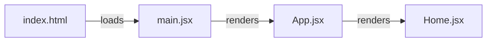
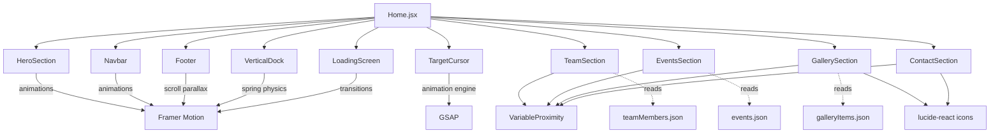
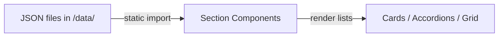

# FAPS Website — Full Project Analysis

## Tech Stack

| Layer | Technology | Version |
|---|---|---|
| **Build Tool** | Vite | 8.0.0-beta.13 |
| **UI Framework** | React | 19.2.0 |
| **Language** | TypeScript + JSX (mixed [.tsx](file:///d:/ACADEMICS/FAPS_WEB/Faps%20Website/Faps%20Website/new_website/src/components/Footer.tsx) / [.jsx](file:///d:/ACADEMICS/FAPS_WEB/Faps%20Website/Faps%20Website/new_website/src/main%20files/App.jsx)) | ES2017 target |
| **Styling** | Tailwind CSS v4 (via `@tailwindcss/vite` plugin) | 4.2.1 |
| **Animation** | Framer Motion | 12.34.4 |
| **Animation (cursor)** | GSAP | 3.14.2 |
| **Icons** | lucide-react | 0.576.0 |
| **Utilities** | clsx, tailwind-merge | — |
| **Fonts** | Google Fonts (Instrument Serif, Playfair Display, Inter, Outfit, Pinyon Script, Manrope, Luxurious Script, Roboto Flex) | CDN |

---

## Directory Structure

```
new_website/
├── index.html              ← HTML shell, loads Google Fonts + entry script
├── vite.config.js          ← Vite plugins: React, Tailwind CSS, tsconfig-paths
├── tsconfig.json           ← TS config with @/* path alias → ./src/*
├── package.json            ← Dependencies & scripts
├── public/
│   └── faps-logo.png       ← Brand logo used in Navbar & Footer
│
└── src/
    ├── main files/
    │   ├── main.jsx         ← React entry point (ReactDOM.createRoot)
    │   ├── App.jsx          ← Root component, renders <Home />
    │   ├── App.css          ← App-level styles
    │   └── index.css        ← Global styles + Tailwind theme tokens
    │
    ├── components/
    │   ├── pages/
    │   │   └── Home.jsx     ← Page-level orchestrator
    │   │
    │   ├── layout/
    │   │   ├── Navbar.tsx         ← Sticky nav (appears on scroll)
    │   │   ├── Footer.tsx         ← Full-screen footer with mixed-font statement
    │   │   └── SectionWrapper.tsx ← Reusable section container
    │   │
    │   ├── sections/
    │   │   ├── HeroSection.tsx    ← Full-viewport landing hero
    │   │   ├── TeamSection.tsx    ← Team member grid cards
    │   │   ├── EventsSection.tsx  ← Accordion-style events list
    │   │   ├── GallerySection.tsx ← Image gallery + lightbox
    │   │   └── ContactSection.tsx ← Contact form with social links
    │   │
    │   ├── reactbits/             ← Custom interactive UI components
    │   │   ├── TargetCursor.tsx   ← GSAP-powered custom cursor
    │   │   ├── VerticalDock.tsx   ← macOS-style side navigation + progress
    │   │   ├── VariableProximity.tsx ← Mouse-proximity variable font effect
    │   │   ├── PillNav.tsx        ← Pill-shaped nav (unused currently)
    │   │   ├── Dock.tsx           ← Horizontal dock (unused currently)
    │   │   └── *.css              ← Co-located CSS for each component
    │   │
    │   └── ui/
    │       ├── LoadingScreen.tsx   ← Animated intro loading screen
    │       └── SectionHeading.tsx  ← Reusable heading component
    │
    ├── data/
    │   ├── teamMembers.json   ← 10 team members with roles, bios, photos
    │   ├── events.json        ← 8 events (3 upcoming, 5 past)
    │   └── galleryItems.json  ← 24 gallery items across 5 categories
    │
    └── hooks/
        ├── useContactForm.ts  ← Form state, validation, simulated submit
        ├── useModal.ts        ← Open/close/toggle with body scroll lock
        └── useScrollSpy.ts    ← IntersectionObserver-based active section
```

---

## How the App Boots



1. **[index.html](file:///d:/ACADEMICS/FAPS_WEB/Faps%20Website/Faps%20Website/new_website/index.html)** — HTML shell. Loads Google Fonts via `<link>` tags, mounts `<div id="root">`, and includes the entry script at [/src/main files/main.jsx](file:///d:/ACADEMICS/FAPS_WEB/Faps%20Website/Faps%20Website/new_website/src/main%20files/main.jsx).
2. **[main.jsx](file:///d:/ACADEMICS/FAPS_WEB/Faps%20Website/Faps%20Website/new_website/src/main%20files/main.jsx)** — Calls `ReactDOM.createRoot`, wraps `<App />` in `<React.StrictMode>`, imports [index.css](file:///d:/ACADEMICS/FAPS_WEB/Faps%20Website/Faps%20Website/new_website/src/main%20files/index.css) (global styles + Tailwind).
3. **[App.jsx](file:///d:/ACADEMICS/FAPS_WEB/Faps%20Website/Faps%20Website/new_website/src/main%20files/App.jsx)** — Minimal root component that just renders `<Home />`.
4. **[Home.jsx](file:///d:/ACADEMICS/FAPS_WEB/Faps%20Website/Faps%20Website/new_website/src/components/pages/Home.jsx)** — The page-level orchestrator that composes the entire single-page app.

---

## Component Connectivity

[Home.jsx](file:///d:/ACADEMICS/FAPS_WEB/Faps%20Website/Faps%20Website/new_website/src/components/pages/Home.jsx) is the central hub. It imports and renders every component in order:



### Key Relationships

| Component | Depends On | Animation Lib | Data Source |
|---|---|---|---|
| **LoadingScreen** | — | Framer Motion | — |
| **TargetCursor** | `.cursor-target` CSS class on interactive elements | GSAP | — |
| **VerticalDock** | Section [id](file:///d:/ACADEMICS/FAPS_WEB/Faps%20Website/Faps%20Website/new_website/src/hooks/useContactForm.ts#30-43) attributes (`#home`, `#team`, etc.) | Framer Motion | Hardcoded array |
| **Navbar** | Section [id](file:///d:/ACADEMICS/FAPS_WEB/Faps%20Website/Faps%20Website/new_website/src/hooks/useContactForm.ts#30-43) attributes for IntersectionObserver | Framer Motion | Hardcoded `navItems` |
| **HeroSection** | — | Framer Motion (scroll parallax) | Hardcoded social/menu links |
| **TeamSection** | [VariableProximity](file:///d:/ACADEMICS/FAPS_WEB/Faps%20Website/Faps%20Website/new_website/src/components/reactbits/VariableProximity.tsx#49-60) component | Framer Motion | [teamMembers.json](file:///d:/ACADEMICS/FAPS_WEB/Faps%20Website/Faps%20Website/new_website/src/data/teamMembers.json) |
| **EventsSection** | [VariableProximity](file:///d:/ACADEMICS/FAPS_WEB/Faps%20Website/Faps%20Website/new_website/src/components/reactbits/VariableProximity.tsx#49-60) component | Framer Motion | [events.json](file:///d:/ACADEMICS/FAPS_WEB/Faps%20Website/Faps%20Website/new_website/src/data/events.json) |
| **GallerySection** | [VariableProximity](file:///d:/ACADEMICS/FAPS_WEB/Faps%20Website/Faps%20Website/new_website/src/components/reactbits/VariableProximity.tsx#49-60), lucide-react (`X`, `ChevronLeft`, `ChevronRight`) | Framer Motion | [galleryItems.json](file:///d:/ACADEMICS/FAPS_WEB/Faps%20Website/Faps%20Website/new_website/src/data/galleryItems.json) |
| **ContactSection** | [VariableProximity](file:///d:/ACADEMICS/FAPS_WEB/Faps%20Website/Faps%20Website/new_website/src/components/reactbits/VariableProximity.tsx#49-60), lucide-react (social icons) | Framer Motion | Hardcoded social links |
| **Footer** | — | Framer Motion (scroll-linked parallax) | Hardcoded statement + links |

---

## Styling System

Global styles are defined in [index.css](file:///d:/ACADEMICS/FAPS_WEB/Faps%20Website/Faps%20Website/new_website/src/main%20files/index.css):

- **Tailwind v4** is imported via `@import "tailwindcss"` and configured with `@theme inline` for custom design tokens.
- **Color palette**: Dark theme (`#131313` primary, `#0a0a0a` secondary, `#F5F5F5` accent text).
- **Custom cursor**: `cursor: none` globally; the [TargetCursor](file:///d:/ACADEMICS/FAPS_WEB/Faps%20Website/Faps%20Website/new_website/src/components/reactbits/TargetCursor.tsx#15-322) component replaces it with a GSAP-animated crosshair.
- **Utility classes**: `.text-gradient`, `.font-script`, `.font-display`, `.letter-spaced` for consistent typography.
- **Animations**: `@keyframes` for `slideUp`, `fadeInLetter`, `blurIn`.
- **Accessibility**: `prefers-reduced-motion` media query disables all animations.
- Each ReactBits component has **co-located CSS** (e.g., [VerticalDock.css](file:///d:/ACADEMICS/FAPS_WEB/Faps%20Website/Faps%20Website/new_website/src/components/reactbits/VerticalDock.css), [TargetCursor.css](file:///d:/ACADEMICS/FAPS_WEB/Faps%20Website/Faps%20Website/new_website/src/components/reactbits/TargetCursor.css)).

---

## Interactive Features

### 1. Custom Cursor ([TargetCursor](file:///d:/ACADEMICS/FAPS_WEB/Faps%20Website/Faps%20Website/new_website/src/components/reactbits/TargetCursor.tsx#15-322))
- Built with **GSAP** for smooth, physics-based cursor tracking.
- Replaces the native cursor with a crosshair.
- Expands and morphs when hovering elements with `.cursor-target` class.

### 2. Vertical Dock ([VerticalDock](file:///d:/ACADEMICS/FAPS_WEB/Faps%20Website/Faps%20Website/new_website/src/components/reactbits/VerticalDock.tsx#89-182))
- A **macOS Dock**-inspired side navigation fixed to the right.
- Dots magnify on mouse proximity using Framer Motion spring physics.
- Shows a scroll **progress indicator** line.
- Uses `IntersectionObserver` to highlight the currently visible section.
- Appears only after scrolling past 30% of viewport height.

### 3. Variable Proximity Text ([VariableProximity](file:///d:/ACADEMICS/FAPS_WEB/Faps%20Website/Faps%20Website/new_website/src/components/reactbits/VariableProximity.tsx#49-60))
- Renders each letter of a heading as an individual `<span>`.
- Uses `requestAnimationFrame` to continuously calculate mouse distance to each letter.
- Interpolates **variable font settings** (`wght`, `wdth`) based on proximity — letters near the cursor become lighter/wider.
- Uses **Roboto Flex** (a variable font) for dynamic weight/width changes.
- Employed in section headings for Team, Events, Gallery, and Contact.

### 4. Loading Screen
- Animated intro sequence using Framer Motion.
- Counter animation, letter-by-letter reveal, and a slide-up exit transition.

---

## Data Flow



- All data is **static JSON** — no API calls, no backend, no database.
- Images are **Unsplash URLs** (external CDN), not local assets.
- The contact form in [ContactSection](file:///d:/ACADEMICS/FAPS_WEB/Faps%20Website/Faps%20Website/new_website/src/components/sections/ContactSection.tsx#32-183) uses a **simulated API call** (`setTimeout`) — no real backend endpoint.

---

## Build & Dev

| Command | What It Does |
|---|---|
| `npm run dev` | Starts Vite dev server with HMR |
| `npm run build` | Production build via Vite |
| `npm run preview` | Preview the production build locally |
| `npm run lint` | Run ESLint |

### Vite Plugins
1. **`@vitejs/plugin-react`** — React Fast Refresh / JSX transform
2. **`@tailwindcss/vite`** — Tailwind CSS v4 integration (no `postcss.config.js` needed)
3. **`vite-tsconfig-paths`** — Resolves `@/*` path aliases from [tsconfig.json](file:///d:/ACADEMICS/FAPS_WEB/Faps%20Website/Faps%20Website/new_website/tsconfig.json)

---

## Notable Observations

> [!NOTE]
> The project mixes [.tsx](file:///d:/ACADEMICS/FAPS_WEB/Faps%20Website/Faps%20Website/new_website/src/components/Footer.tsx) (TypeScript) and [.jsx](file:///d:/ACADEMICS/FAPS_WEB/Faps%20Website/Faps%20Website/new_website/src/main%20files/App.jsx) (JavaScript) files. The entry points ([main.jsx](file:///d:/ACADEMICS/FAPS_WEB/Faps%20Website/Faps%20Website/new_website/src/main%20files/main.jsx), [App.jsx](file:///d:/ACADEMICS/FAPS_WEB/Faps%20Website/Faps%20Website/new_website/src/main%20files/App.jsx), [Home.jsx](file:///d:/ACADEMICS/FAPS_WEB/Faps%20Website/Faps%20Website/new_website/src/components/pages/Home.jsx)) are plain JS, while all components and hooks are TypeScript.

> [!NOTE]
> The [tsconfig.json](file:///d:/ACADEMICS/FAPS_WEB/Faps%20Website/Faps%20Website/new_website/tsconfig.json) contains leftover Next.js references (`"next"` plugin, `next-env.d.ts`, `.next/types/**`), suggesting the project was migrated from Next.js to Vite. These don't cause errors but are unused.

> [!NOTE]
> Some components in `reactbits/` ([Dock.tsx](file:///d:/ACADEMICS/FAPS_WEB/Faps%20Website/Faps%20Website/new_website/src/components/reactbits/Dock.tsx), [PillNav.tsx](file:///d:/ACADEMICS/FAPS_WEB/Faps%20Website/Faps%20Website/new_website/src/components/reactbits/PillNav.tsx)) and `components/` root ([Navbar.tsx](file:///d:/ACADEMICS/FAPS_WEB/Faps%20Website/Faps%20Website/new_website/src/components/Navbar.tsx), [Footer.tsx](file:///d:/ACADEMICS/FAPS_WEB/Faps%20Website/Faps%20Website/new_website/src/components/Footer.tsx), [SectionWrapper.tsx](file:///d:/ACADEMICS/FAPS_WEB/Faps%20Website/Faps%20Website/new_website/src/components/SectionWrapper.tsx)) are **not imported anywhere** — they appear to be duplicates or unused alternatives of the versions in `layout/`.
